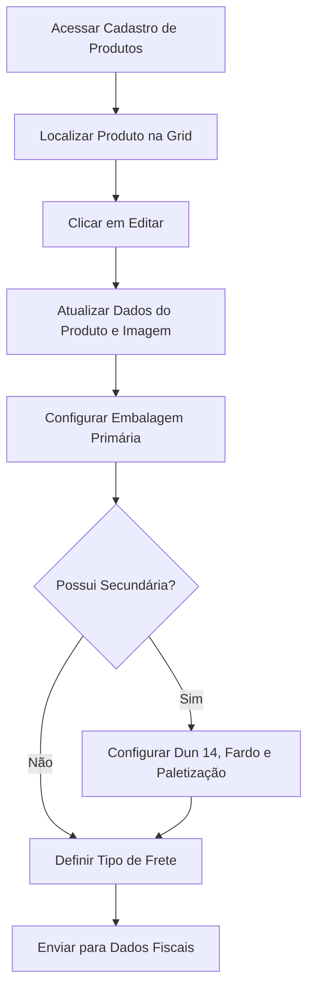

## Introdução

O **Cadastro de Produtos** é o coração da inteligência logística e comercial da sua rede. Ele funciona como um catálogo digital centralizado que reúne descrições técnicas, códigos identificadores, imagens e dados de embalagem. Este cadastro é a base fundamental para a gestão de estoque, recebimento de mercadorias e criação de campanhas promocionais.

!!! info "Caminho"
    Menu Lateral Esquerdo → Cadastro de Produtos

## Entrega de Valor

- **Centralização:** Todas as informações técnicas e comerciais em um único local.
- **Padronização:** Garante que o produto seja identificado da mesma forma em todas as lojas.
- **Eficiência Logística:** Dados detalhados de peso e dimensões para otimização de estoque.
- **Integração:** Sincronização automática com o seu sistema de gestão (ERP).
- **Histórico:** Rastreabilidade de alterações e atualizações de dados.

## Funcionalidades Principais
### 1. Gestão e Filtros na Grid
Na tela principal, você visualiza a listagem completa dos produtos cadastrados. A grid permite uma gestão ágil através de:

- **Pesquisa Dinâmica:** Busca por nome/descrição, código de barras ou código do fornecedor.
- **Filtros Avançados:** Filtre por Etapa, Fornecedor, Comprador ou visualize registros excluídos.
- **Status de Fluxo:** Acompanhe produtos em estágios: _Em andamento_, _Recusado_ ou _Concluído_.
- **Personalização:** Altere e organize as colunas da visualização conforme sua necessidade.

### 2. Detalhamento da Edição: Dados do Produto e Imagem
Esta seção é a porta de entrada para a identificação comercial do item e sua representação visual no catálogo.

| **Identificador do Campo**      | **Obrigatório?** | **Regra de Negócio / Comportamento**                                              |
| ------------------------------- | ---------------- | --------------------------------------------------------------------------------- |
| **Comprador**                   | Sim (*)          | Selecione o comprador da rede responsável por gerir este cadastro.                |
| **Empresa/Fornecedor**          | Sim              | Define o fornecedor ou empresa fabricante do produto.                             |
| **Vendedor responsável**        | Não              | Exibe automaticamente o nome do usuário que iniciou o cadastro (campo bloqueado). |
| **Descrição Completa**          | Sim (*)          | Nome detalhado com especificações (Sabor, Volume, Marca).                         |
| **Código de barras do produto** | Sim (*)          | Identificação EAN/GTIN principal (essencial para o PDV).                          |
| **Código Fornecedor**           | Sim (*)          | Código de referência do fabricante que constará na Nota Fiscal.                   |
**Regras para Imagem do Produto**

- **Requisitos:** Tamanho entre **100 KB e 3 MB**.
- **Formato:** PNG ou JPG com fundo **BRANCO** ou **TRANSPARENTE**.
- **Ação:** Use o botão **Desvincular esta imagem** para substituição rápida.

### 3. Detalhamento: Embalagem Primária
Dados logísticos da unidade que o consumidor final adquire.

|**Campo**|**Obrigatório?**|**Descrição / Comportamento**|**Exemplo**|
|---|---|---|---|
|**Tipo de embalagem**|Sim|Ex: Caixa, Fardo, Pacote, PET, Lata.|PET|
|**Conteúdo**|Sim|Volume/massa (Ex: 1 LITRO = 1,000 / 350 ML = 0,350).|2,000|
|**Unidade de medida**|Sim|Escala métrica (Quilo, Litro, Gramas, ML).|ML|
|**Altura / Largura / Prof.**|Sim|Dimensões em centímetros (Ex: 30,0 = 30 cm).|23,0 / 12,0 / 12,0|
|**Dias de validade**|Não|Prazo total de expiração em dias.|60|
|**Formato de venda**|Sim|Unidade comercial de saída (KG, UNID, L).|UNID|
|**Produto pesável?**|Não|Switch para habilitar pesagem em balança no PDV.|Inativo|
|**Peso Bruto / Líquido**|Sim|Peso total (com embalagem) e peso real (conteúdo).|20,00|

!!! tip "Embalagem Secundária"
    Ative o **Possui embalagem secundária?** para configurar o recebimento em fardos ou caixas.

### 4. Detalhamento: Embalagem Secundária e Transporte
Configurações para logística de atacado e regras de paletização.

|**Campo**|**Obrigatório?**|**Descrição / Função**|**Exemplo**|
|---|---|---|---|
|**Dun 14**|Sim|Código de barras da unidade de despacho (agrupador).|Dun 14|
|**Tipo de embalagem**|Sim|Formato do agrupador (FARDO, CAIXA, ENGRADADO).|FARDO|
|**Conteúdo (Secundária)**|Sim|Soma do volume de todas as unidades internas.|16,000|
|**Qtd. por fardo/caixa**|Sim|Quantas unidades primárias vêm no agrupador.|8|
|**Peso Bruto / Líquido**|Sim|Peso total do fardo/caixa completo.|160,00|
|**Medidas do Fardo**|Sim|Altura, Largura e Profundidade do fardo (cm).|28,0 / 96,0 / 24,0|

**Logística de Paletização e Frete**

- **Quantidade no palete:** Total de embalagens primárias por palete completo.
- **Empilhamento:** Quantos níveis (andares) de fardos o palete suporta.
- **Quantidade por camada:** Quantos fardos cabem em cada camada do palete.
- **Tipo de frete:** Define a modalidade negociada (Ex: **FOB** - Comprador assume o frete).

## Fluxo de Trabalho

## Perguntas Frequentes (FAQ)

!!! question "O que acontece se eu preencher o peso bruto incorretamente?"
    Dados de peso incorretos podem causar divergências no recebimento de mercadorias e erros no cálculo de frete. Sempre revise os valores com base na ficha técnica do fornecedor.

!!! question "Para que serve o campo 'Código Fornecedor'?"
    É o "link" entre o seu sistema e a nota fiscal do fabricante. Ter esse campo correto facilita a entrada automática de notas e evita erros de digitação.

!!! question "Qual a diferença entre Peso Líquido e Peso Bruto?"
    O **Peso Líquido** é o conteúdo real do produto. O **Peso Bruto** inclui a embalagem. Para logística e frete, o **Peso Bruto** é o dado mais relevante.

## Considerações Finais

Um cadastro de produtos bem executado evita rupturas de estoque e garante que sua comunicação de marketing utilize sempre a descrição e imagem corretas. Ao finalizar todas as etapas, clique no botão **Enviar para Dados Fiscais** no canto inferior direito para concluir o processo logístico.