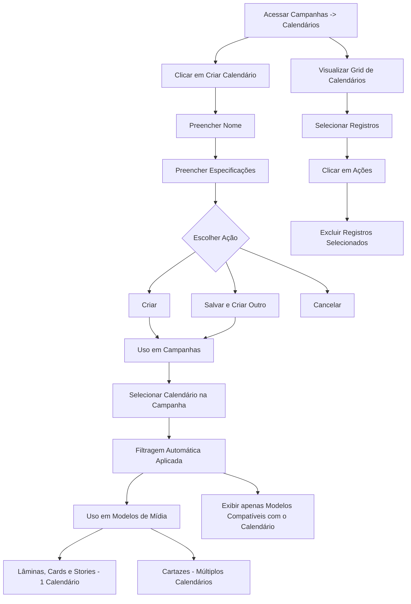

## Introdução

O **Calendário de Campanhas** é o coração do seu planeamento. Com ele, você organiza e visualiza todas as ações promocionais do ano de forma estratégica, garantindo que as campanhas recorrentes sigam um padrão e que nenhum período importante seja esquecido.

> [!NOTE] Caminho
> Menu Lateral esquerdo → Campanhas → Calendários

## Entrega de Valor

- **Planejamento Estratégico:** Visão antecipada das campanhas do ano.
- **Padronização:** Eventos recorrentes com configurações predefinidas.
- **Organização:** Evita sobreposição e conflitos de datas.
- **Eficiência:** Criação mais rápida com modelos vinculados.
- **Histórico:** Comparação facilitada com anos anteriores.

## Funcionalidades Principais

### 1: Criação de Calendários
1. Acesse **Campanhas -> Calendários**.
2. Clique em **Criar Calendário**.
3. Preencha as informações conforme a tabela abaixo:

| **Campo**          | **Descrição**                         | **Dica de Ouro**                                        |
| ------------------ | ------------------------------------- | ------------------------------------------------------- |
| **Nome**           | Identificação do grupo (Obrigatório). | Use o padrão "Nome + Ano" (Ex: _Natal 2025_).           |
| **Especificações** | Texto livre para notas.               | Insira aqui os objetivos da campanha ou o público-alvo. |
####  Opções de Finalização
No momento de salvar o registro, escolha a ação que melhor atenda ao seu fluxo:

| **Botão**                | **Comportamento**                                                        | **Objetivo Principal**                                                        |
| ------------------------ | ------------------------------------------------------------------------ | ----------------------------------------------------------------------------- |
| **Criar**                | Salva o registro e mantém o usuário na mesma tela, habilitando a edição. | Ideal para quem precisa revisar ou detalhar o calendário logo após a criação. |
| **Salvar e Criar Outro** | Conclui o registro atual e limpa os campos para um novo cadastro.        | Focado em produtividade para cadastros em lote (múltiplos itens).             |

> [!TIP] O botão **Cancelar** interrompe o processo sem salvar e redireciona para a grid de calendários já existentes. 

> [!TIP] Status na grid
> O **Status** é gerado automaticamente pelo sistema no momento em que o registro é finalizado, ficando como **Publicado**.

<video src="../../images/Gravando%202026-03-24%20151016.mp4" controls width="100%"></video>
### 2: Uso do Calendário em Campanhas
Ao criar uma campanha, você pode vincular um calendário:
**Benefícios da Vinculação:**
- **Filtragem**: Facilita encontrar campanhas relacionadas
- **Modelos de Mídia**: Os modelos de mídia vinculados ao mesmo calendário aparecem automaticamente como opções
- **Organização**: Agrupa campanhas por tema ou período
- **Relatórios**: Permite análises agrupadas por calendário

**Como Funciona:**
1. Ao criar uma campanha, selecione o calendário no campo "Calendário"
2. O sistema filtra automaticamente os Modelos de Mídia compatíveis com o calendário selecionado
3. Durante a diagramação, apenas modelos vinculados ao mesmo calendário aparecem como opções

### 3: Uso do Calendário em Modelos de Mídia
Os modelos de mídia também podem ser "etiquetados" com um calendário para garantir que a comunicação visual esteja sempre alinhada:
- **Lâminas, Cards e Stories:** Geralmente são vinculados a **um único calendário** específico.
- **Cartazes:** Podem aceitar **múltiplos calendários**, permitindo mais flexibilidade na criação.

### 4: Visualização e Gerenciamento
Na tela principal de **Calendários**, você tem uma visão completa de tudo o que foi planejado. É o seu painel de controle para manter a organização em dia.

#### O que você pode fazer na Grid?
- **Acompanhar tudo:** Veja todos os seus calendários em uma única lista organizada.
- **Manutenção simples:** Precisa mudar algo? Você pode **Editar** as informações ou **Excluir** calendários que não serão mais utilizados.

> [!TIP] Exclusão em massa
> Na grid de calendários, é possível utilizar o botão **Abrir Ações** para excluir registros selecionados, otimizando a limpeza de calendários antigos.
> Caminho: Acesse Calendários > Marque o Checkbox "Nome" > Clique no botão "Abrir ações" > Selecione os calendários para exclusão > Excluir selecionado.

#### Dicas para uma Organização Impecável (Boas Práticas)
Para que o sistema trabalhe a seu favor e você ganhe tempo no dia a dia, siga estas recomendações:
- **Nomes que falam por si:** Escolha nomes claros e descritivos. Em vez de apenas "Promoção", use "Ofertas Relâmpago - Outubro 2025". Isso facilita muito a busca depois.
- **Agrupar é a chave:** Procure manter campanhas que tenham o mesmo contexto dentro do mesmo calendário. Isso evita que as informações fiquem espalhadas.
- **Mantenha o padrão:** Tente organizar seus calendários sempre seguindo um tema (ex: Dia das Mães) ou um período específico (ex: Verão 2025). Isso ajuda muito na hora de tirar relatórios e analisar resultados

> [!INFO] Considerações Importantes
> 
> - **O calendário não armazena datas:** Ele é apenas um agrupador. As datas de vigência são definidas dentro da Campanha.
>     
> - **Edição Segura:** Você pode editar o nome de um calendário mesmo que ele já possua campanhas vinculadas; isso não afetará os dados das campanhas.
>     
> - **Exclusão:** Se excluir um calendário, as campanhas vinculadas não são apagadas, elas apenas perdem a referência do agrupador.
>     
# Casos de Uso

## Caso 1: Organização por Eventos Sazonais
Imagine uma rede de supermercados que precisa gerenciar dezenas de artes e ofertas ao longo do ano. Veja como os calendários simplificam essa rotina:
### O Cenário
A equipe de marketing cria calendários específicos para as grandes datas do varejo:
- **Páscoa 2025:** Reúne todas as ofertas de chocolates e bacalhau.
- **Dia das Mães 2025:** Focado em presentes e almoço especial.
- **Black Friday 2025:** Concentra as promoções agressivas de eletrônicos e bazar.
- **Natal 2025:** Agrupa tudo relacionado à ceia e presentes de fim de ano.
### Por que isso é bom na prática?
- **Foco Total:** Ao abrir o calendário "Natal", você vê apenas o que importa para aquela data, sem misturar com outras promoções.
- **Seleção sem Erros:** Quando você cria uma campanha de Páscoa, o sistema já "filtra" os modelos de mídia (como artes de ovos de chocolate) automaticamente. Você não corre o risco de usar o fundo errado!
- **Histórico que Funciona:** No próximo ano, você consegue consultar exatamente o que foi feito em 2025 para cada tema, facilitando o planejamento do futuro.
- **Organização Visual:** Sua lista de campanhas deixa de ser uma "bagunça" de nomes e passa a ser um cronograma organizado por temas claros.

## Caso 2: Ofertas Semanais Recorrentes
Sabe aquelas ofertas que acontecem toda semana, de quinta a domingo? Em vez de criar tudo do zero toda vez, o calendário ajuda a padronizar o processo.
### O Cenário
A loja cria um calendário fixo chamado **"Ofertas Semanais 2025"**.
### Como isso facilita o dia a dia?
- **Padrão de Qualidade:** Todas as campanhas de ofertas da semana são "carimbadas" com esse calendário.
- **Agilidade na Criação:** Ao abrir uma nova campanha semanal, o sistema já traz os modelos de mídia padrão (aqueles que você já usa toda semana). Você só precisa trocar os preços e produtos!
- **Busca Simples:** Quer saber o que entrou em oferta nas últimas 4 semanas? Basta filtrar pelo calendário semanal e ter a lista completa na tela.

## Caso 3: Organização por Regiões (Nacional vs. Regional)
Se a sua rede tem lojas em diferentes estados ou cidades, você sabe que o que vende no Sul nem sempre é o que vende no Nordeste. O calendário ajuda a separar essas realidades.
### O Cenário
A equipe de marketing organiza a comunicação em três níveis:
- **Calendário Nacional:** Campanhas que valem para a rede toda (ex: Aniversário do Supermercado).
- **Calendário Regional Sul:** Ofertas de inverno, vinhos e itens típicos da região.
- **Calendário Regional Nordeste:** Promoções de verão antecipado e itens regionais específicos.
### Por que isso é bom na prática?
- **Sem Confusão:** O gerente da loja do Nordeste não corre o risco de ver ou usar, por engano, uma arte criada especificamente para o Sul.
- **Organização por Local:** Cada região tem seu "quadrado". Você consegue gerenciar o que é nacional e o que é local de forma totalmente separada.
- **Artes Corretas:** Modelos de mídia com preços ou regionalismos específicos ficam "presos" aos seus calendários correspondentes, garantindo que a comunicação certa chegue ao lugar certo.

## Permissões Necessárias

Para garantir a segurança e a organização das informações, o acesso às funcionalidades de Calendário é dividido por perfis. Confira o que cada nível de acesso permite fazer:

| Ação           | Quem pode fazer (Perfis)                 | O que é permitido?                                         |
| -------------- | ---------------------------------------- | ---------------------------------------------------------- |
| **Criar**      | Gestor de Marketing ou Administrador     | Criar novos grupos de calendários do zero.                 |
| **Editar**     | Gestor de Marketing ou Administrador     | Alterar nomes ou especificações de calendários já criados. |
| **Visualizar** | Todos os usuários do módulo de campanhas | Consultar a lista e usar os calendários nas campanhas.     |
| **Excluir**    | Gestor de Marketing ou Administrador     | Remover calendários (Ação irreversível).                   |

## Fluxo de Trabalho

## Perguntas Frequentes

> [!QUESTION] Posso ter múltiplos calendários ativos ao mesmo tempo?
> Sim! É comum ter múltiplos calendários para organizar diferentes tipos de campanhas (eventos sazonais, ofertas semanais, campanhas regionais, etc.).

> [!QUESTION] O calendário armazena eventos ou datas?
> Não. O calendário é apenas um agrupador. As datas e períodos são definidos diretamente nas campanhas.

> [!QUESTION] Posso editar um calendário que já tem campanhas vinculadas?
> Sim, você pode editar o nome e descrição do calendário a qualquer momento. Isso não afeta as campanhas vinculadas.

> [!QUESTION] Campanhas precisam estar vinculadas a calendários?
> Não é obrigatório, mas é altamente recomendado para organização e para que os modelos de mídia apropriados apareçam automaticamente.

> [!QUESTION] Como funciona a filtragem de modelos de mídia por calendário?
> Ao criar uma campanha vinculada a um calendário, apenas os modelos de mídia vinculados ao mesmo calendário aparecem como opções durante a diagramação.

> [!QUESTION] Posso vincular um modelo de mídia a múltiplos calendários?
> Para cartazes, sim. Um modelo de cartaz pode ser vinculado a múltiplos calendários. Para lâminas, cards e stories, cada modelo é vinculado a apenas um calendário.

> [!QUESTION] O que acontece se eu excluir um calendário?
> As campanhas vinculadas não são excluídas, mas ficam sem calendário. Os modelos de mídia vinculados também não são excluídos, mas perdem a vinculação.
## Considerações Finais
A configuração correta dos calendários é o primeiro passo para uma operação de marketing eficiente e organizada, garantindo que a equipe de diagramação tenha sempre as ferramentas certas para cada tema promocional.

## Leia Também
- [[Gestão de campanhas]]
- [[../Fornecedores|Fornecedores]]