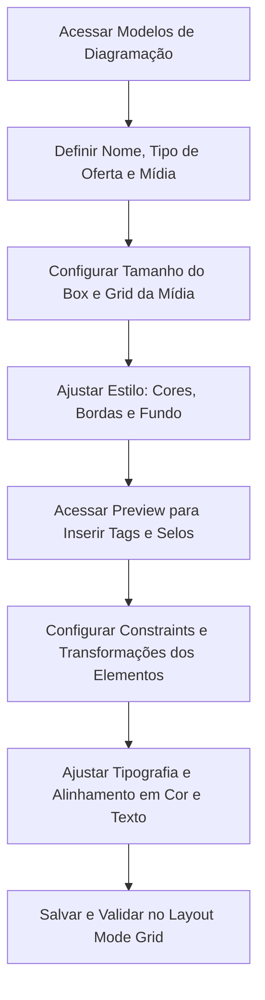

### Introdução

Os **Modelos de Diagramação** são o módulo onde ocorre o ajuste fino da identidade visual dos produtos. É através deste recurso que é possível configurar o comportamento dos boxes, posicionar as tags de informação (como nome e preço), inserir selos promocionais e desenhar a estética individual de cada oferta que comporá a mídia final.

!!! info "Caminho"
    Menu Lateral Esquerdo → Campanhas → Modelos de Diagramação

### Funcionalidades e Campos de Cadastro
Ao criar ou editar um modelo de diagramação, preencha as informações conforme os campos abaixo:

|**Campo**|**Descrição**|
|---|---|
|**Nome**|Defina um nome identificável para o modelo.|
|**Tipo de Oferta**|Selecione entre as modalidades **Regular** ou **Clube**.|
|**Tipo de Mídia**|Escolha o formato: **Cartaz, Storie, Card, Lâmina ou Encarte**.|
|**Tamanho do Box**|Define o espaço ocupado na grade (ex: 1x1). Ideal para produtos secundários.|
|**Altura / Largura**|Define as dimensões fixas do box em pixels.|
|**Grid da Mídia**|Define o número de colunas que a grid da mídia possuirá.|
|**Destaque**|Define se este box específico deve ser tratado como um item de destaque.|
|**Imagem de Fundo**|Permite carregar uma imagem de fundo específica para o box, se houver.|

### Seção Configurações de Estilo
Nesta seção, definimos a aparência estrutural do box:

- **Cor Principal:** Define a cor padrão para textos. Caso fique vazia, o sistema utilizará a cor do Modelo de Mídia.
- **Cor Secundária:** Define a cor para preços e unidades. Segue a hierarquia: Elemento → Modelo de Diagramação → Modelo de Mídia.
- **Borda:** Define se o box terá borda visível.
- **Cor e Estilo da Borda:** Define a tonalidade e o tipo de traçado (sólido, tracejado, etc).
- **Cantos (Superior/Inferior):** Configura o arredondamento ou presença de borda em cada quina (esquerda/direita).
- **Cor de Fundo:** Define a cor interna do box.

### Seção Preview (Editor Visual)
O Preview é a área de manipulação direta, onde as tags são posicionadas e estilizadas.

- **Lado Esquerdo:** Menu com as **Tags Disponíveis** (descrição, preço, validade, etc.) e botões de ação: _Salvar, Resetar Mídia, Desfazer, Refazer, Copiar, Colar, Trazer para Frente, Trazer para Trás, Deletar e Resetar Card_.
- **Lado Direito:** Painel para edição detalhada do box e dos elementos selecionados.

### Painel de Edição de Elementos
Ao selecionar uma tag ou elemento dentro do box, utilize as abas abaixo:
#### 1. Editar
Menu de acesso rápido para navegar entre as funções de **Posição, Transformar e Cor**.
#### 2. Transformar
Configura o comportamento físico e o alinhamento do elemento.

- **Assistência de Layout:**
    - **Smart Guides da Região:** Aproximação automática das regiões às guias.
    - **Snap da Grade:** "Imanta" o elemento aos quadrados da grade.
    - **Exibir Linhas de Grade:** Ativa/Desativa a visualização visual do grid.
    
- **Constraints do Elemento:**
    
    - **Redimensionar com a Caixa:** O elemento acompanha o movimento de redimensionamento do box.
    - **Quebra Automática de Texto:** Força a quebra de linha caso o texto exceda o limite do elemento.
    - **Manter Proporção:** Bloqueia a escala para evitar distorções.
- **Transformação:** Permite definir a **Rotação** do elemento.
#### 3. Cor e Texto
Define toda a tipografia e aparência visual.

- **Texto:** Gerencia Conteúdo, Origem da Cor, Fonte, Tamanho, Estilo (Negrito/Itálico), Decoração (Sublinhado/Riscado), Alinhamento, Altura da Linha, Espaçamento entre letras e Transformação (Maiúsculas/Minúsculas).
- **Aparência:** Configura Cor de Fundo do elemento, Borda, Estilo, Espessura e Raio (arredondamento).
#### 4. Posição
Ajuste fino das coordenadas e dimensões exatas do elemento selecionado.

#### 5. Selos
Permite vincular selos promocionais que já estejam cadastrados no sistema ao modelo.

### Fluxo de Trabalho

### Perguntas Frequentes (FAQ)
!!! question "Qual a diferença prática entre o Tipo de Oferta Regular e Clube?"
    O tipo **Regular** é utilizado para preços de gôndola padrão. O tipo **Clube** permite que o modelo puxe campos específicos de fidelidade, como "Preço exclusivo para sócios" ou selos de identificação de clube de descontos.

!!! question "O que acontece se eu não definir uma Cor Principal no Modelo de Diagramação?"
    O sistema seguirá a hierarquia de cores. Caso o campo esteja vazio, ele buscará automaticamente a cor definida no **Modelo de Mídia**. Se lá também estiver vazio, ele utilizará o padrão do elemento original.

!!! question "Para que serve a função 'Redimensionar elemento junto com a caixa'?"  
    Esta função garante que, ao aumentar ou diminuir o tamanho do box na grade da campanha, os elementos internos (como o preço ou a foto do produto) se ajustem proporcionalmente, evitando que fiquem "cortados" ou fora do lugar.

!!! question "Como posso garantir que o nome do produto não 'atropele' o preço?" 
    Utilize a função **Quebra automática de texto** dentro da seção Constraints. Isso garante que, se o nome for muito longo, ele pule para a linha de baixo em vez de sobrepor outros elementos do box.

!!! question "Posso usar o mesmo Modelo de Diagramação para um Cartaz e um Storie?" 
    Não é recomendado. Como as dimensões (Altura e Largura) e a proporção visual são muito diferentes, o ideal é criar um modelo específico para cada **Tipo de Mídia** para garantir que a diagramação fique legível e esteticamente correta.
    
### Considerações Finais
A estruturação minuciosa dos Modelos de Diagramação é o que garante que a estratégia de preços e produtos seja apresentada de forma clara e profissional. Ao dominar as configurações de estilo, hierarquia de cores e o uso correto das constraints de layout, você assegura que a diagramação seja resiliente a diferentes tamanhos de box e tipos de oferta. Este módulo é a peça final que une a parte técnica do sistema à criatividade do marketing, garantindo que cada selo, tag e preço esteja exatamente onde deve estar para converter a venda.