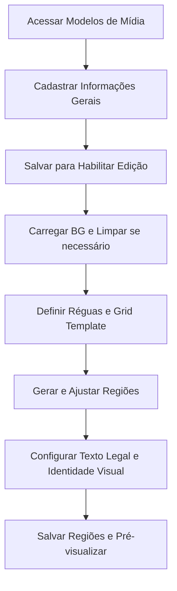

### Introdução

Os **Modelos de Mídia** são o alicerce visual das suas campanhas. É neste módulo que inserimos os fundos (BGs), definimos as áreas de atuação (regiões) e configuramos a hierarquia visual de fontes e cores. Eles garantem que, independentemente de quem esteja operando, o resultado final siga estritamente a identidade visual da marca.

!!! info "Caminho"
    Menu Lateral Esquerdo → Campanhas → Modelos de Mídia

### Funcionalidades e Campos de Cadastro
Ao criar ou editar um modelo de mídia, preencha as informações conforme os campos abaixo:

|**Campo**|**Descrição**|
|---|---|
|**Nome**|Descrição da mídia para identificação no sistema.|
|**Tipo de Mídia**|Define qual mídia está sendo feita: **Cartaz, Lâmina, Card ou Storie**.|
|**Calendário**|Vincule o calendário correspondente.|
|**Modelo de Diagramação**|Vincule o modelo de diagramação que será a base da mídia.|
|**Tipo de Página**|**Interna:** Usado geralmente para as páginas de miolo.      **Capa:** Utilizado para diferenciar capas (ex: capa com 4 produtos e interna com 12) ou capas com BGs diferentes.|
|**Modo de Layout**|Define o comportamento das regiões (ex: Regiões Livres).|
|**Produtos por Página**|Define quantos produtos aparecem por peça (ex: Card com 2 produtos e Storie com 4), independente de quantos forem colocados na campanha.|
|**Fonte Principal**|Fonte das descrições. Segue a hierarquia: Modelo de Mídia → Modelo de Diagramação → Elemento.|
|**Fonte Secundária**|Fonte de números e preços. Segue a mesma hierarquia de busca.|
|**Cor Principal**|Cor primária definida seguindo a hierarquia de aplicação.|
|**Cor Secundária**|Cor secundária definida seguindo a hierarquia de aplicação.|

!!! tip "Importante"
    É necessário **Salvar** o registro para habilitar os outros campos e abas de configuração.

### Configurações Avançadas

#### 1. Criar Configuração de Oferta
Utilizado quando se trabalha com tipos específicos de oferta (Clube, Escalonado, etc.). É necessário criar essa configuração para buscar o modelo de diagramação correto; caso contrário, o sistema sempre utilizará o padrão vinculado no Modelo de Mídia.

#### 2. Editar Regiões (Layout Mode: Regions)
Nesta área é feita a definição técnica do espaço útil da mídia.

- **Botão Limpar Background:** Limpa o BG atual, possibilitando colocar um modelo pronto apenas para servir de base na hora de desenhar as regiões.
    

**Ao clicar em "Criar boxes via grid template":**

- Para criar as regiões, é necessário arrastar as réguas até a posição desejada.
- Em **Layout Mode**, escolha **Regions**.
- Em **Template**, defina o número de colunas e linhas e clique em **“Aplicar margens a partir das réguas”**.
- Clique em **Gerar Regiões**.

**Configurações do Grid:**

- **Gap Horizontal e Vertical:** Distanciamento entre as regiões desenhadas.
- **Margem Superior e Inferior (px):** Definição das margens do topo e fundo.
- **Margem Esquerda e Direita (px):** Definição das margens laterais.
- **Largura Base e Altura Base (px):** Definição das dimensões reais do BG.
- **Substituir:** Se marcado, irá substituir o trabalho feito anteriormente pelo novo grid.

### Gestão de Regiões Selecionadas
Ao selecionar uma região específica no desenho, as seguintes opções ficam disponíveis:

- **Produto Destaque:** Define a região selecionada como a que sempre receberá o produto principal/destaque.
- 
**Campos em "Região Selecionada":**

- **Nome:** Descrição da região.
- **Tipo de Região:** Define se é uma região **Normal** ou para **Upload de Imagem**.
- **X e Y / Largura e Altura:** Definição numérica exata do tamanho e posição da região.
- **Criar Modelo da Região:** Possibilita criar um modelo de diagramação específico baseado no tamanho do box desenhado.
- **Cor da Borda:** Define a cor da borda da região.
- **Cor de Fundo:** Define a cor de fundo da região.

### Abas de Guias
#### Smart Guias

- **Ativar Smart Guides:** Exibe linhas vermelhas de alinhamento ao arrastar uma região.
- **Snap no Canvas:** Cola a região nas extremidades do canvas.
- **Snap de Elementos:** Ativa a aproximação magnética entre regiões.
- **Snap da Grade:** Aproxima a região pelos quadradinhos da grade.
- **Exibir Linhas de Grade:** Ativa ou desativa a visualização da grade sobre o BG.
- **Guias de Espaçamento:** Mostra o valor do espaçamento entre regiões durante o movimento.

#### Réguas e Guias

- **Exibir Réguas:** Mostra as réguas numeradas.
- **Exibir Guias:** Visualização das réguas que foram desenhadas.
- **Travar Guias:** Impede a movimentação acidental das réguas.
- **Snap nas Guias:** Aproximação automática das regiões às guias.
- **Exibir Área Útil:** Exibe o desenho dentro do limite das réguas.
### Aba Texto Legal

Configurações para as informações jurídicas da mídia:
- **Conteúdo:** Texto que será exibido.
- **Alinhamento da Caixa:** Alinhamento do box de texto legal na mídia.
- **Alinhamento do Texto:** Alinhamento interno do texto (Esquerda, Centro, Direita).
- **Esquerda (px) / Bottom (px):** Posição da caixa em relação à esquerda e ao fundo.
- **Largura / Altura:** Dimensões da caixa de texto legal.
- **Fonte / Tamanho / Peso / Cor:** Especificações tipográficas do texto legal.
- **Altura da Linha:** Espaçamento entre as linhas dentro do box.

### Comandos e Botões de Ação

- **Botão CTRL Pressionado:** Permite desenhar uma **Região Livre** clicando e arrastando.
- **Adicionar Região:** Insere uma nova região manualmente no BG.
- **Remover Selecionada:** Remove apenas a região que está selecionada.
- **Limpar Regiões:** Apaga todas as regiões do BG de uma vez.
- **Salvar Regiões:** Salva as configurações de desenho no BG.
- **Layout Mode Grid:** Abre uma pré-visualização de como as regiões ficarão preenchidas.

### Fluxo de Trabalho

