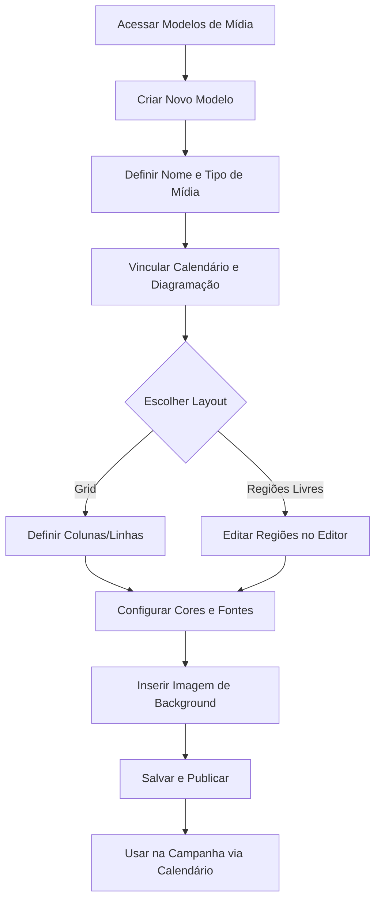

## Introdução
O módulo de **Modelos de Mídia** permite criar e gerenciar modelos reutilizáveis para peças promocionais. Através de modelos configuráveis, é possível padronizar a criação de cartazes, lâminas, cards e stories, garantindo a identidade visual e agilizando o processo de criação.

!!! info "Caminho" 
    Menu Lateral esquerdo → Campanhas e Ofertas → Config. das Campanhas → Modelos de Mídia

## Entrega de Valor

- **Padronização:** Garante que a identidade visual seja respeitada em todas as peças.
- **Agilidade:** Reduz o trabalho manual ao reutilizar estruturas pré-definidas.
- **Escalabilidade:** Permite criar múltiplos formatos (impresso e digital) a partir de um único planejamento.
- **Eficiência:** Criação mais rápida com modelos vinculados a calendários e diagramações.

## Funcionalidades na Grid
Na tela principal, você tem o controle total dos modelos existentes:

- **Filtros:** Possibilidade de filtrar por calendário vinculado, tipo de mídia, modelo de diagramação e registros excluídos.
- **Ações:** Editar modelos existentes, replicar modelos (para criar variações rapidamente) e criar novos.

## Especificações por Tipo de Mídia
Ao criar um novo modelo, as características mudam conforme o tipo selecionado:

### Lâmina (Tabloides e Encartes)
Página com múltiplos produtos organizados em grid ou layout estruturado.

- **Configurações:** Requer um **Modelo de Organização** (define quantidade e posições dos produtos).
- **Vínculo:** Associada a um único calendário específico (campo obrigatório).
- **Orientação:** Retrato ou Paisagem.

### Cartaz (Materiais de PDV)
Material impresso para produto único, ideal para destaques.

- **Tamanhos:** A3, A4, A5, A6 e Régua (formato personalizado em faixa horizontal).
- **Vínculo:** Pode ser associado a **múltiplos calendários** (campo obrigatório).
- **Diferencial:** Opção para criar versão espelhada (exclusivo A5).

### Story (Social Media Vertical)

Formato vertical (9:16) otimizado para mobile (Instagram/Facebook).
- **Dimensões:** 1080 × 1920 px.
- **Vínculo:** Um calendário por story (campo obrigatório).

### Card (Digital e Redes Sociais)

Peça gráfica quadrada (1:1) para redes sociais, apps ou totens digitais.
- **Vínculo:** Um calendário por card (campo obrigatório).
- **Uso:** Otimizado para materiais digitais.

## Detalhes de Configuração e Layout

- **Calendário:** Vincule o calendário deste modelo. Para saber mais sobre os calendários, leia em: [Calendários](https://suporte552.github.io/documentacao/Campanhas/Calend%C3%A1rios/)
- **Modelo de Diagramação:** Vincule o modelo de diagramação. Para saber mais sobre o modelo de diagramação, leia em: [Modelos de diagramação](https://suporte552.github.io/documentacao/Campanhas/Modelos%20de%20diagrama%C3%A7%C3%A3o/)
- **Tipo de Página:** Selecione se o modelo é **Capa** ou **Interna**.
- **Modelo de Layout:** 

    * **Grid:** Organização automática (permite posição/tamanho livre na grid).
    - **Regiões Livres:** Edição manual no botão **"Editar regiões"**. Para saber mais sobre o editor, [clique aqui](https://suporte552.github.io/documentacao/Tutoriais/Como%20usar%20o%20editor%20no%20modelo%20de%20m%C3%ADdia/)

- **Identidade Visual:** Definição de Fonte Principal, Fonte Secundária, Cor Principal e Cor Secundária.
- **Background:** Upload da imagem de fundo (BG) do modelo.
- **Configuração de Oferta:** Vincule modelos de diagramação específicos para tipos como **Regular** e **Clube**, facilitando a troca automática de layouts de preço.

## Integrações
O Modelo de Mídia é o ponto de união entre a estratégia e a arte:

- **Vínculo com Diagramação e Calendários:** O modelo de mídia não funciona isoladamente; ele depende do Modelo de Diagramação (que define os dados) e do Calendário (que define o agrupamento).
- **Automação na Campanha:** Através do calendário escolhido no modelo, o sistema permite que ele apareça automaticamente como opção de configuração na campanha criada, garantindo que a comunicação certa saia no período correto.

## Casos de Uso

### Caso 1: Padronização de Ofertas de WhatsApp (Cards)
Uma rede precisa enviar ofertas diárias para listas de transmissão.

- **Ação:** Cria-se um modelo de **Card** vinculado ao calendário "Ofertas Diárias".
- **Resultado:** O operador apenas vincula os produtos e o sistema gera as imagens com os preços formatados, sem precisar de edição manual.

### Caso 2: Campanha de Sazonalidade (Lâminas)
Criação de um encarte especial para o "Aniversário da Loja".

- **Ação:** Cria-se um modelo de **Lâmina** com background festivo vinculado ao calendário de Aniversário.
- **Resultado:** Todas as páginas internas do encarte seguem a mesma estrutura de grid e identidade visual automaticamente.

### Caso 3: Sinalização de Loja (Cartazes)
O cartaz A4 é usado em diversas promoções diferentes ao longo do mês.

- **Ação:** Cria-se um modelo de **Cartaz** e vincula-se a ele **múltiplos calendários** (Semanal, Açougue, Higiene).
- **Resultado:** O mesmo layout profissional fica disponível para todas essas frentes de campanha.
## Fluxo de Trabalho

---

## Perguntas Frequentes (FAQ)

!!! question "Posso vincular um cartaz a mais de um calendário?"
    Sim, os cartazes permitem múltiplos calendários para que o mesmo modelo de sinalização seja usado em diversas campanhas.

!!! question "O que acontece se eu não configurar o background?" 
    O modelo ficará sem uma base visual, o que pode comprometer a estética da peça final na diagramação.

!!! question "Como o sistema sabe qual preço usar (Clube ou Regular)?"
    Isso é definido na "Configuração de Oferta", onde você vincula os modelos de diagramação específicos para cada tipo de preço dentro do modelo de mídia.

## Considerações Finais

A correta integração entre Modelos de Mídia, Calendários e Diagramação é o que garante a eficiência da plataforma, permitindo que artes complexas sejam geradas em segundos com total segurança visual.

**Leia Também**