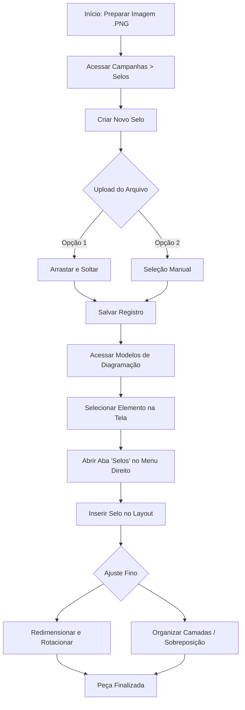

## Introdução

Os **Selos** são elementos visuais essenciais para destacar ofertas e novidades nas suas peças. Eles funcionam como badges promocionais (ex: "50% OFF", "NOVO", "LANÇAMENTO", "CLUBE") que podem ser aplicados diretamente nos modelos de diagramação para atrair a atenção do consumidor.

!!! info "Caminho"
    Menu Lateral esquerdo → Campanhas → Selos

## Entrega de Valor

- **Destaque Visual:** Chama a atenção para condições especiais de venda.
- **Flexibilidade:** Ajuste total de tamanho e posicionamento conforme o layout.
- **Padronização:** Garante que toda a comunicação utilize a mesma identidade visual para promoções.
- **Agilidade:** Uma vez cadastrado, o selo fica disponível para uso rápido em qualquer diagramação.

## Funcionalidades Principais

### 1: Criação de Selos
Acesse **Campanhas -> Selos** -> Clique em **Criar**. 
Preencha as informações conforme os campos abaixo:
- **Nome**: Identificação do selo;
- **Imagem**: Para que o selo esteja disponível na diagramação, você precisa realizar o upload do arquivo visual. O sistema oferece duas formas práticas de inserção:
    - **Arrastar e Soltar:** Selecione o arquivo de imagem em seu computador e arraste-o diretamente para a área demarcada no campo "Imagem".
    - **Seleção Manual:** Clique no ícone de upload dentro do campo "Imagem" para abrir o explorador de arquivos do seu computador e selecionar o arquivo desejado.

!!! tip "Dica de Formato" Para garantir um acabamento profissional na diagramação, utilize arquivos em formato **.PNG com fundo transparente**. Isso evita que o selo sobreponha o produto com um "quadrado branco" indesejado.

#### Opções de Finalização
No momento de salvar o registro, escolha a ação que melhor atenda ao seu fluxo:

| **Botão**                | **Comportamento**                                                        | **Objetivo Principal**                                            |
| ------------------------ | ------------------------------------------------------------------------ | ----------------------------------------------------------------- |
| **Criar**                | Salva o registro e mantém o usuário na mesma tela, habilitando a edição. | Ideal para quem precisa revisar o selo logo após a criação.       |
| **Salvar e Criar Outro** | Conclui o registro atual e limpa os campos para um novo cadastro.        | Focado em produtividade para cadastros em lote (múltiplos itens). |

!!! tip "Botão cancelar" 
    O botão **Cancelar** interrompe o processo sem salvar e redireciona para a grid de selos já existentes.

### 2: Vinculo no modelo de diagramação
Após cadastrar os selos, eles ficam disponíveis na biblioteca do editor do modelo de diagramação para serem aplicados às suas peças. Veja como utilizá-los e como organizar as camadas para um visual perfeito:

!!! info "Caminho"
    Menu lateral esquerdo → Campanhas → **Modelos de Diagramação**

#### Passo a Passo para Inserção:
1. **Acesse o Modelo:** Selecione o modelo de diagramação que deseja editar.
2. **Ative o Menu de Edição:** Clique em qualquer componente da tela para habilitar o **menu lateral direito**.
3. **Selecione o Selo:** No menu lateral direito, clique na aba **Selos** e escolha o selo desejado para inseri-lo na tela.

#### Ajuste de Sobreposição (Camadas)
Para que o selo apareça exatamente onde você deseja (por exemplo, à frente do produto, mas atrás de um texto), utilize as ferramentas de ordenação:

- **Organização de Camadas:** Localize os ícones de seta ao lado da lixeira no menu de propriedades do elemento.
- **Recuar Elemento:** Utilize o botão **"Send Backward"** (ou o atalho `Ctrl` + `Shift` + `Down`) para mover o elemento para trás, nível por nível, até que ele fique posicionado abaixo do componente desejado.
- **Trazer para Frente:** Se o selo sumir atrás de uma imagem, utilize o botão **"Bring Forward"** para trazê-lo para o topo.

**Dica de Ouro:** Ao selecionar o selo no editor, você também pode usar o mouse para ajustar o **tamanho** (puxando pelas extremidades) e a **rotação** (utilizando o ícone circular acima do elemento).

### 3: Visualização e Gerenciamento
Na tela principal de Selos, você tem uma visão completa de todos os elementos cadastrados.

**O que você pode fazer na Grid?**

- **Acompanhar tudo:** Veja todos os seus selos em uma única lista organizada.
- **Manutenção simples:** Precisa mudar a imagem ou o nome? Você pode **Editar** as informações ou **Excluir** selos que não serão mais utilizados.

!!! info "Exclusão em massa" 
    Na grid de selos, é possível utilizar o botão **Abrir Ações** para excluir registros selecionados, otimizando a limpeza de selos antigos. 
    **Caminho:** Acesse Selos > Marque o Checkbox "Cover" > Clique no botão "Abrir ações" > Selecione os selos para exclusão > Excluir selecionado.

## Fluxo de Trabalho

# Perguntas Frequentes (FAQ)

!!! question "Qual o melhor formato de arquivo para cadastrar um selo?"
    O formato ideal é o **.PNG com fundo transparente**. Isso garante que o selo não fique com um quadrado branco ao redor, permitindo um acabamento profissional sobre as imagens dos produtos.

!!! question "Posso ajustar o tamanho e a posição do selo após inseri-lo no layout?"
    Sim! Ao selecionar o selo no editor de diagramação, você pode utilizar o mouse para redimensionar (puxando pelas extremidades), rotacionar (usando o ícone circular) e arrastar para qualquer posição.

!!! question "O que fazer se o selo ficar "escondido" atrás de outro elemento na tela?"
    Você deve utilizar as ferramentas de **Organização de Camadas**. No menu de propriedades, utilize o botão **"Bring Forward"** para trazer o selo para a frente ou **"Send Backward"** para movê-lo para trás de outros componentes.

!!! question "Como excluir vários selos antigos de uma só vez?"
    Na grid principal de Selos, marque o checkbox **"Cover"** (para selecionar todos) ou selecione os itens individualmente. Depois, clique no botão **"Abrir ações"** e escolha **"Excluir selecionado"**.

!!! question "Para que serve a opção 'Salvar e Criar Outro' no cadastro?"
    Essa opção é focada em produtividade. Ela conclui o cadastro do selo atual e já limpa os campos para que você inicie um novo imediatamente, sendo ideal para cadastros em lote.

## Considerações Finais
A utilização correta dos selos é um diferencial estratégico para destacar suas promoções e guiar o olhar do consumidor. Ao manter uma biblioteca organizada e padronizada em PNG transparente, você garante que a equipe de marketing tenha agilidade total na criação de peças visualmente atraentes e profissionais.

## Leia Também
* [Modelos de Diagramação](#)
* [Gestão de Campanhas](../Campanhas/Gestão de campanhas.md)
* [FAQ de Selos](#)