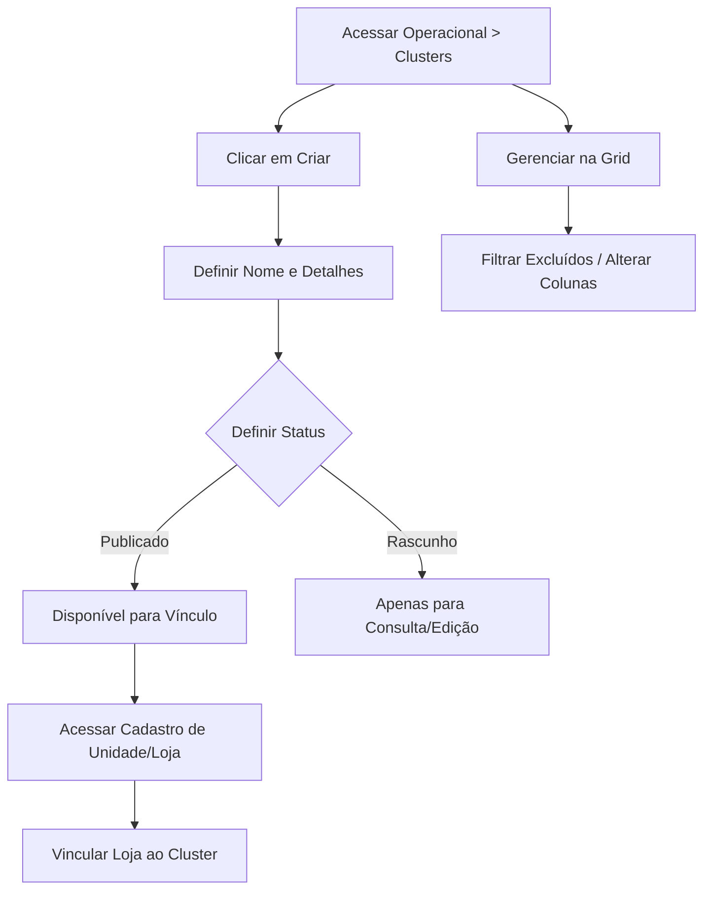

## Introdução

Os **Grupos** (também chamados de Clusters) são uma forma essencial de organizar suas unidades de negócio. Eles funcionam como pastas inteligentes que agrupam lojas com características em comum — seja por região geográfica, porte da unidade, perfil de público ou qualquer critério estratégico que faça sentido para sua operação.

!!! info "Caminho"
    Menu Lateral esquerdo → Operacional → Clusters

## Entrega de Valor

- **Segmentação Estratégica:** Permite aplicar ações específicas para grupos selecionados de lojas.
- **Organização Logística:** Facilita a gestão de unidades por proximidade ou região.
- **Agilidade em Escala:** Ao atualizar um cluster, você impacta todas as lojas vinculadas a ele.
- **Padronização:** Garante que lojas com o mesmo perfil recebam a mesma comunicação ou sortimento.

## Funcionalidades Principais
### 1: Criação de Clusters
Acesse **Operacional -> Clusters** e clique em **Criar**. Preencha as informações conforme a tabela abaixo:

|**Campo**|**Descrição**|**Dica de Ouro**|
|---|---|---|
|**Nome**|Identificação do grupo (Obrigatório).|Use nomes claros como "Lojas Nordeste" ou "Hipermercados".|
|**Especificações**|Detalhes sobre o critério do grupo.|Descreva o que une essas lojas (Ex: "Lojas com faturamento acima de X").|

**Status do Registro:**

- **Publicado:** O cluster está ativo e pronto para receber vínculos de lojas.
- **Rascunho:** O cluster fica salvo para edição, mas não aparece como opção de vínculo nas unidades.

**Opções de Finalização:**

- **Criar:** Salva o registro e permite continuar a edição.
- **Salvar e Criar Outro:** Finaliza o atual e abre a tela em branco para um novo cadastro.

!!! tip "Botão cancelar"
    O botão **Cancelar** interrompe o processo sem salvar e redireciona para a grid de clusters existentes.

### 2: Integração com Unidades (Lojas)
A função do Cluster se concretiza no cadastro das lojas.

- Ao cadastrar ou editar uma **Unidade (Loja)**, você deve selecionar a qual **Grupo (Cluster)** ela pertence.
- Uma loja vinculada a um cluster herda as regras e filtros definidos para aquele grupo, otimizando a gestão em massa.

### 3: Visualização e Gerenciamento na Grid
A grid de clusters oferece ferramentas poderosas para controle e limpeza de dados:

- **Pesquisa Direta:** Utilize a barra de busca para encontrar clusters específicos pelo nome.
- **Alterar Colunas:** Personalize sua visualização definindo quais colunas (Nome, Especificações, Data de Criação) deseja ver na tela.
- **Filtros de Exclusão:** * Não exibir registros excluídos (Padrão).
    
    - Exibir registros excluídos (Lista tudo).
    - Somente registros excluídos (Para recuperação ou auditoria).

!!! info "Exclusão em massa"
    Na grid de clusters, você pode realizar a limpeza rápida: Marque o checkbox **"Nome"** (para selecionar todos) ou escolha itens específicos > Clique em **Abrir Ações** > Selecione **Excluir selecionados**.

## Casos de Uso
### Caso 1: Regionalização de Ofertas
Uma rede de supermercados tem preços diferentes para o Litoral e para o Interior.

- **A Prática:** Cria-se o Cluster "Litoral" e o Cluster "Interior". As lojas são vinculadas aos seus respectivos grupos.
- **O Resultado:** Ao lançar uma campanha, o marketing seleciona o Cluster "Litoral" e o sistema automaticamente sabe quais lojas devem receber aquela comunicação.

### Caso 2: Clusters por Porte de Loja
Uma franquia possui lojas "Express" (pequenas) e lojas "Premium" (grandes).

- **A Prática:** Agrupar lojas pelo tamanho garante que modelos de mídia de grande formato não sejam enviados por engano para lojas pequenas que não têm espaço físico para exposição.

## Fluxo de Trabalho

---

## Perguntas Frequentes (FAQ)

!!! question "O que acontece com as lojas se eu excluir um Cluster?"
    As lojas não são excluídas, mas perdem o vínculo com o grupo. Elas ficarão "órfãs" de cluster até que você as vincule a um novo grupo manualmente.

!!! question "Posso trocar uma loja de cluster a qualquer momento?"
    Sim. Basta editar o cadastro da Unidade (Loja) e selecionar o novo cluster desejado. A mudança é instantânea para fins de filtragem.

!!! question "Para que serve o filtro de 'Registros Excluídos'?"
    Ele serve para manter o histórico. Se você excluiu um cluster por engano, pode filtrar por "Somente excluídos" para consultar os dados que estavam lá anteriormente.

## Considerações Finais
A organização por clusters é a base para uma comunicação segmentada e eficiente. Grupos bem definidos evitam erros de logística e garantem que a mensagem certa chegue à unidade correta, poupando tempo operacional da equipe de marketing e vendas.

## Leia Também