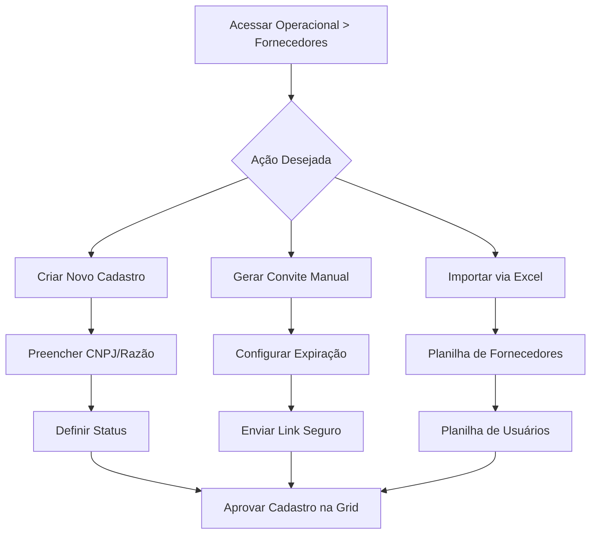

## Introdução

O Portal do Fornecedor é uma interface dedicada que permite aos parceiros acessar o sistema de forma independente. Com ele, é possível gerenciar produtos, visualizar campanhas e enviar propostas diretamente para os clientes da Gomark, estabelecendo um relacionamento B2B2C eficiente e colaborativo.

!!! info "Caminho"
    Menu Lateral esquerdo → Operacional → Fornecedores

## Entrega de Valor

- **Autonomia:** Fornecedores gerenciam seus próprios dados e propostas.
- **Colaboração Direta:** Estreita o relacionamento entre parceiros e a plataforma.
- **Segurança:** Controle total sobre quem acessa e quais convites estão ativos.
- **Escalabilidade:** Importação em lote de usuários e fornecedores via Excel.

## Funcionalidades Principais

### 1: Gestão de Parceiros na Grid
Na tela principal de fornecedores, você tem o controle total dos cadastros.
**Criar Parceiro do Zero:** Ao clicar em "Criar", preencha as informações conforme os campos abaixo:

- **Obrigatórios:** CNPJ, Nome e Razão Social.
- **Opcionais:** E-mail, telefone e descrição.
- **Status:** Defina o parceiro como **Ativo** ou **Inativo**.

**Opções de Finalização:**

- **Criar:** Salva e mantém na tela para edição.
- **Salvar e Criar Outro:** Salva e limpa os campos para um novo cadastro rápido.
- **Vincular a um Parceiro:** Permite buscar e associar um fornecedor já existente no banco de dados através do CNPJ.

!!! tip "Botão cancelar" 
    O botão **Cancelar** interrompe o processo sem salvar e redireciona para a grid de fornecedores.

### 2: Gerar Convite de Cadastro
Esta funcionalidade permite convidar novos parceiros via e-mail com total segurança.
**Configurações do Convite:**

- **E-mal do Vendedor (Opcional):** E-mail para envio do convite. 
- **Permitir Uso Múltiplo (Toggle):** 

    * **Ativado:** O link pode ser usado por várias pessoas da mesma empresa.
    - **Desativado (Padrão):** O link expira após o primeiro uso.
    
- **Expiração:** Você pode definir o prazo de validade (1, 3, 7, 15 ou 30 dias). Recomendamos **7 dias**.

!!! info "Segurança do Link" 
    O sistema gera um token aleatório de 48 caracteres. O link valida automaticamente o ID do cliente, a expiração e a unicidade do token, garantindo que apenas o fornecedor autorizado realize o cadastro via HTTPS.

### 3: Importação de Dados
Para cadastros em massa, utilize as ferramentas de importação via planilha Excel:

- **Importar Fornecedores:** Carrega os dados das empresas parceiras.
- **Importar Usuários:** Carrega os acessos dos colaboradores desses fornecedores no sistema.

### 4: Edição e Vinculação de Vendedores
Ao editar um fornecedor já cadastrado, você pode gerenciar a equipe comercial dele:

1. **Cadastrar Vendedor:** Informe nome do representante, e-mail e defina uma senha de acesso.
2. **Associar Vendedor:** Vincule um vendedor que já existe no sistema ao fornecedor através da busca por nome ou e-mail.

## Gerenciamento na Grid
Ao selecionar o checkbox **"Razão Social"** na listagem principal, novas ações são habilitadas:

- **Exportar:** Gera um arquivo com os dados dos fornecedores selecionados.
- **Aprovar:** Valida o cadastro do fornecedor para operação.
- **Voltar para Rascunho:** Permite reverter um cadastro aprovado para ajustes internos.

## Casos de Uso

### Caso 1: Prospecção de Novos Parceiros via Convite
Imagine que sua rede de varejo está expandindo o setor de bebidas e precisa cadastrar 10 novas vinícolas parceiras rapidamente.

- **O Cenário:** Em vez de pedir os documentos por e-mail e cadastrar um por um, o comprador gera **convites individuais** no sistema.
- **A Prática:** O comprador configura os convites com validade de **7 dias** e uso único.
- **O Resultado:** Cada vinícola recebe o link seguro, preenche seus próprios dados e, assim que finalizam, os cadastros aparecem na sua grid para apenas um clique de **Aprovação**. Isso economiza horas de trabalho manual da sua equipe.

### Caso 2: Cadastro em Lote para Grandes Campanhas
Sua empresa vai realizar uma "Semana do Fornecedor" e precisa importar os dados de 50 novos parceiros e seus respectivos 100 vendedores que atuarão na plataforma.

- **O Cenário:** O cadastro manual seria inviável para o prazo da campanha.
- **A Prática:** Você utiliza a função **Importar Fornecedores** via Excel para subir os dados das empresas e, em seguida, usa o **Importar Usuários** para liberar o acesso de todos os vendedores de uma só vez.
- **O Resultado:** Em poucos minutos, todo o ecossistema de parceiros está criado e pronto para enviar propostas de produtos para as artes das campanhas.

## Fluxo de Trabalho

---

## Perguntas Frequentes (FAQ)

!!! question "O que acontece se o link do convite expirar?" 
    O parceiro não conseguirá acessar a tela de cadastro. Será necessário gerar um novo convite no painel administrativo.

!!! question "Qual a diferença entre 'Uso Múltiplo' ativado ou desativado?" 
    Se estiver **desativado**, apenas a primeira pessoa que clicar conseguirá se cadastrar; o link "morre" depois disso. Se estiver **ativado**, você pode enviar o mesmo link para vários departamentos de um fornecedor.

!!! question "Posso vincular um vendedor a mais de um fornecedor?" 
    Sim, através da opção de "Associar", você consegue conectar representantes a diferentes CNPJs de fornecedores parceiros.

!!! question "Como aprovar um fornecedor que acabou de se cadastrar via convite?"
    Na grid de fornecedores, selecione o registro desejado através do checkbox e utilize a opção de "Aprovar" que aparecerá no menu de ações.

## Considerações Finais

O gerenciamento de fornecedores é o ponto de partida para o ecossistema colaborativo da Gomark. Manter os cadastros aprovados e os vendedores vinculados corretamente garante que o fluxo de propostas e produtos ocorra sem interrupções.

## Leia Também

- [Gestão de Campanhas](../Campanhas/Gestão de campanhas.md)
- [Calendário de Campanhas](https://www.google.com/search?q=../Campanhas/Calend%C3%A1rios.md)
- [Configurações de Perfil](https://www.google.com/search?q=%23)