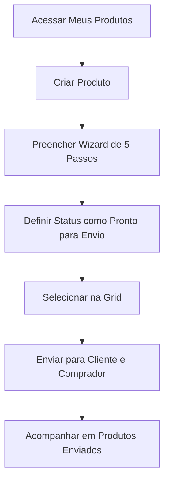

## Introdução

O **Portal do Fornecedor** é o ambiente exclusivo onde o parceiro comercial interage com o sistema. É nesta seção que o fornecedor centraliza o cadastro de seus produtos, gerencia os vínculos com suas empresas e envia ofertas diretamente para os compradores, garantindo que os dados cheguem padronizados para o processo de compra.

!!! info "Caminho" 
    Menu Lateral Esquerdo → Portal do Fornecedor

## Entrega de Valor

- **Autonomia:** O fornecedor é responsável pela inserção dos dados técnicos e imagens.
- **Agilidade:** Redução de erros de digitação manual no ERP.
- **Transparência:** Acompanhamento do status de aprovação dos produtos enviados.

## Funcionalidades do Menu

A estrutura lateral do portal permite a gestão completa do ciclo de vida do produto:

- **Menu painel de controle:** Consegue verificar pedidos por status através de um gráfico e demais informações.
- **Minhas empresas:** Cadastro de fornecedores vinculados em seu usuário. Dessa forma, para usar nos produtos cadastrados.
- **Produtos enviados:** Produtos cadastrados que foram enviados para os compradores. Possível visualizar quais estão criados, em análise, em andamento, recusados, concluídos e arquivados.
- **Meus produtos:** Possível cadastrar produtos para envio.

## Fluxo de Cadastro de Produto (Wizard)

Para iniciar um novo registro, acesse **Meus produtos** e clique no botão **"Criar produto"**. Preencha os campos de controle inicial e, ao confirmar, o sistema apresentará o Wizard dividido em 5 passos obrigatórios:

### PASSO 1 — Identificação

|Campo|Descrição|
|---|---|
|**Empresa / Fornecedor**|Qual empresa (PJ) está fornecendo este produto|
|**Descrição completa**|Nome completo do produto com especificações e características|
|**Código de barras**|Código de barras do produto (EAN/GTIN)|
|**Código do fornecedor**|Código interno do fabricante — o mesmo que constará na nota fiscal|
|**Imagem do produto**|Upload da imagem do produto|

### PASSO 2 — Dados Financeiros

|Campo|Descrição|
|---|---|
|**Custo tabela fornecedor**|Preço de tabela do produto, sem considerar negociação|
|**Preço sugerido PDV**|Preço sugerido de venda ao consumidor no ponto de venda|

### PASSO 3 — Dados Fiscais

|Campo|Descrição|
|---|---|
|**Origem / Procedência**|Nacional, Importado, etc.|
|**Código NCM**|Classificação fiscal com busca integrada|
|**ICMS (%)**|Percentual de ICMS|
|**Possui Substituição Tributária?**|Indica se o produto tem ST|
|**Código CEST**|Código Especificador da Substituição Tributária (visível quando há ST)|
|**% MVA Interno / Ajustado**|Margem de Valor Agregado interno e ajustado (visível quando há ST)|
|**Valor da ST**|Valor da substituição tributária negociada|
|**Possui IPI? / IPI (%)**|Tributação por IPI quando aplicável — de 0 a 100%|

### PASSO 4 — Dados Logísticos

**Embalagem Primária**

|Campo|Descrição|
|---|---|
|**Tipo de embalagem**|Ex.: Caixa, Fardo, Pacote, Lata, Garrafa|
|**Conteúdo / Unidade de medida**|Quantidade dentro da embalagem e unidade (Quilo, Litro, Grama, Unidade...)|
|**Altura / Largura / Profundidade**|Dimensões da embalagem primária (cm)|
|**Dias de validade**|Prazo de validade do produto em dias|
|**Formato de venda**|Como o produto é vendido: KG, UNID, L, M...|
|**O produto é pesável?**|Se é vendido por peso (muda os campos de peso visíveis)|
|**Peso aproximado / bruto / líquido**|Pesos conforme o tipo de produto|
|**Tipo de frete**|Modalidade de frete negociada com o fornecedor|

**Embalagem Secundária _(visível quando marcado)_**

|Campo|Descrição|
|---|---|
|**Tipo de embalagem secundária**|Ex.: Caixa master, Fardo de caixas|
|**Conteúdo da embalagem secundária**|Quantidade de embalagens primárias dentro da secundária|
|**DUN-14**|Código de barras da embalagem secundária|
|**Altura / Largura / Profundidade secundária**|Dimensões da embalagem secundária (cm)|
|**Peso bruto / líquido secundário**|Pesos da embalagem secundária|
|**Empilhamento**|Quantos níveis de empilhamento o palete comporta|
|**Quantidade por camada**|Quantidade de embalagens secundárias por camada de palete|
|**Quantidade por caixa/fardo/pacote**|Quantidade de produtos por unidade de transporte|

### PASSO 5 — Dados Adicionais

|Campo|Descrição|
|---|---|
|**Categoria mercadológica**|Categorização na árvore mercadológica|
|**Marca / Submarca / Modelo / Tipo**|Identificação do produto|
|**Referência / Cor / Sabor / Fragrância**|Atributos específicos do produto|
|**Descrição auxiliar / Informação adicional**|Complementos para uso interno|
|**Status**|`Rascunho` (ainda editando) ou `Pronto para envio`|

## Fluxo de Envio ao Comprador

O cadastro permanece na área privada do fornecedor (**Meus produtos**) até que o envio seja formalizado:

1. Acesse a grid de **"Meus produtos"**.
2. Selecione o(s) produto(s) desejado(s).
3. Clique na ação **"Enviar para cliente"**.
4. No formulário, selecione o **Cliente** (Rede) e o **Comprador** responsável.
5. Clique em **Enviar**. O item passará a ser listado em **"Produtos enviados"** para acompanhamento.

## Perguntas Frequentes (FAQ)

!!! question "Posso editar um produto que já foi enviado?" 
    Não. Após o envio para o comprador, o produto fica em modo de visualização para garantir que a negociação ocorra sobre dados fixos.

!!! question "O que acontece se o comprador recusar o produto?"
    O produto retornará para a grid com o status **Recusado** e o motivo da recusa poderá ser visualizado nos detalhes.

## Fluxo de Trabalho

## Considerações Finais

A implementação do **Portal do Fornecedor** representa um marco na eficiência operacional da organização. Ao transferir a etapa inicial de cadastro para o parceiro comercial, eliminamos processos manuais passíveis de erros e garantimos que a base de dados do ERP seja alimentada com informações técnicas, fiscais e logísticas precisas.

## Leia Também