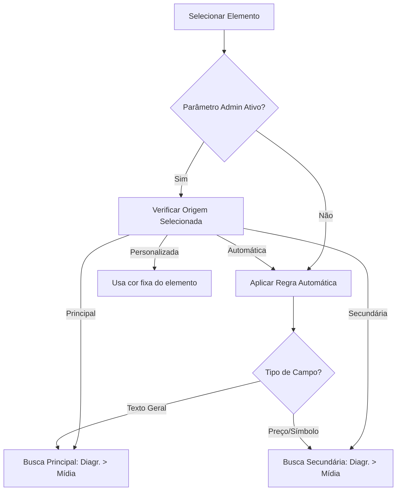

## Introdução

Para garantir a identidade visual e a legibilidade das ofertas, o sistema utiliza uma hierarquia inteligente na definição das cores dos elementos. Essa estrutura permite automatizar o design, mantendo a flexibilidade para personalizações pontuais.

!!! info "Caminho"
    Módulo **Campanhas e Ofertas** → Conf. das Campanhas  **Modelos de Diagramação** → Selecione o elemento → No painel, clique em **Cor e Texto** → **Origem da Cor**.

## Entrega de Valor

- **Padronização Automática:** Aplicação rápida de cores institucionais em grandes volumes de ofertas.
- **Hierarquia Inteligente:** Garante que, na ausência de uma cor específica, o sistema busque a próxima referência válida.
- **Flexibilidade:** Permite tratar exceções através da cor personalizada sem quebrar o padrão do restante do encarte.
- **Redução de Erros:** Evita que elementos fiquem ilegíveis ou com cores fora do guia de marca.
## Funcionalidades Principais
### 1. Níveis de Origem da Cor
As cores dos elementos podem ser herdadas de três níveis distintos:

1. **Elemento (Tag):** Cor definida individualmente dentro do Modelo de Diagramação.
2. **Modelo de Diagramação:** Cores (Principal e Secundária) configuradas para aquele template específico.
3. **Modelo de Mídia:** Cores (Principal e Secundária) configuradas na base do arquivo de mídia.

### 2. Regra de Configuração (Painel Administrativo)

Existe um parâmetro global no painel do administrador que define o comportamento das cores. **Entre em contato com o suporte para ativar ou desativar esta função.**

#### **Quando ATIVADO**
O sistema respeita a **Origem da Cor** selecionada no elemento:

| **Opção**             | **Comportamento**                                                                                                                                                                             |
| --------------------- | --------------------------------------------------------------------------------------------------------------------------------------------------------------------------------------------- |
| **Automática**        | O sistema separa por tipo de campo:  • **Preços/Símbolos (R$, de, por):** Cor Secundária. • **Demais textos:** Cor Principal. _(Busca na Diagramação; se vazio, busca na Mídia)._ |
| **Cor Principal**     | Força o uso da Cor Principal da Diagramação. Se não houver, busca a da Mídia.                                                                                                                 |
| **Cor Secundária**    | Força o uso da Cor Secundária da Diagramação. Se não houver, busca a da Mídia.                                                                                                                |
| **Cor Personalizada** | Ignora as regras acima e utiliza a cor exata definida manualmente no elemento.                                                                                                                |

#### **Quando DESATIVADO**
As opções de Cor Principal, Secundária e Personalizada do elemento são **ignoradas** na geração final. O sistema aplicará sempre a **Regra Automática por tipo de campo**:

- **Preço/Símbolos** = Cor Secundária.
- **Textos** = Cor Principal.
- _Lógica de busca:_ 1º Diagramação → 2º Mídia.
## Ordem de Precedência
Caso a primeira opção de cor esteja vazia, o sistema segue esta ordem:
### Para Cor Principal:

1. **1º** Cor Principal da Diagramação.
2. **2º** Cor Principal da Mídia.

### Para Cor Secundária:

1. **1º** Cor Secundária da Diagramação.
2. **2º** Cor Secundária da Mídia.

 !!! tip "Cores vazias" 
     Se todas as opções de cores (Diagramação e Mídia) estiverem vazias, o elemento será renderizado na cor **cinza**.

<video src="../../images/2026-04-16 15-04-37.mp4" controls width="100%"></video>
## Fluxo de Trabalho

---

## Solução de Problemas (FAQ)

!!! question "Por que meu texto não pegou a cor correta?"
    1. **Verifique o Parâmetro:** Confirme com o suporte se a configuração de cores está ligada no painel administrativo.
    2. **Confirme a Origem:** No modelo de diagramação, veja se o elemento está como Automática, Principal, Secundária ou Personalizada.
    3. **Cheque a Diagramação:** Verifique se existem cores definidas nos campos "Cor Principal" e "Cor Secundária" do Modelo de Diagramação.
    4. **Cheque a Mídia:** Se a diagramação estiver vazia, verifique se o Modelo de Mídia possui as cores definidas.
    5. **Tudo Cinza?** Se o resultado final for cinza, significa que não há cores definidas nem na Diagramação, nem na Mídia.

## Considerações Finais
A hierarquia de cores é fundamental para que a troca de um Modelo de Mídia (ex: mudar de um encarte de "Natal" para "Aniversário") atualize automaticamente todos os textos e preços para as novas cores sazonais sem necessidade de edição manual elemento por elemento.