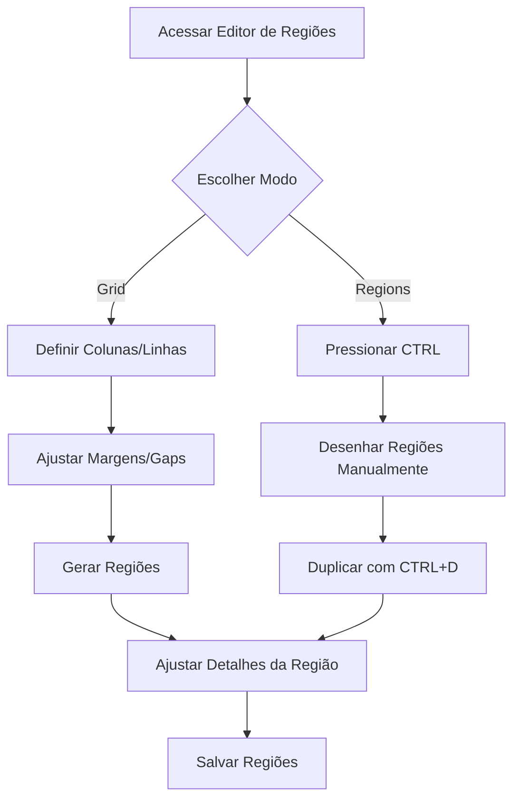

## Introdução

O Editor de Modelos de Mídia é a ferramenta técnica onde você define a estrutura visual das suas peças. Através dele, é possível configurar grids inteligentes ou desenhar regiões personalizadas, garantindo que os produtos e informações ocupem o espaço exato planejado para a comunicação da sua marca.

!!! info "Caminho"
    Menu Lateral esquerdo → Campanhas e Ofertas → Config. das Campanhas → Modelos de Mídia → Editar modelo de mídia → Botão **"Editar regiões"**

## 1. Interface Principal e Modos de Layout
Ao abrir o editor, você visualiza o canvas central com réguas e o painel de controle à esquerda.
**Layout Mode:**

- **Regions:** Modo de edição livre para criar, mover e redimensionar áreas manualmente.
- **Grid:**  XXXXXXXXXXXXXXXXXXXXXXX

**Botões de Ação Superior:**
- **Adicionar região:** Cria um novo box no canvas.
- **Remover selecionada:** Exclui a região que está em foco.
- **Limpar regiões:** Apaga todas as regiões do modelo de uma só vez.
- **Salvar regiões:** Confirma e grava todas as alterações feitas.
## 2. Configurações de Background
No painel lateral, você gerencia a imagem de fundo:

- **Miniatura do BG:** Exibe a imagem atual (ex: Lâmina Stories).
- **Limpar background:** Remove a imagem de fundo atual para permitir a subida de um novo arquivo ou trabalhar com fundo limpo.

## 3. Template de Regiões (Criação em Lote)
Para gerar várias áreas de uma vez de forma organizada, utilize o painel de Template:

|**Campo**|**Função**|
|---|---|
|**Colunas / Linhas**|Define a quantidade de divisões verticais e horizontais.|
|**Gap (Horizontal/Vertical)**|Define o espaçamento em pixels entre as regiões.|
|**Margens (Sup/Inf/Esq/Dir)**|Recuo interno para que as regiões não toquem nas bordas ou cabeçalhos.|
|**Largura / Altura base**|Dimensões totais do canvas (ex: 1080x1920 para Stories).|

- **Aplicar margens a partir das réguas:** Ajusta automaticamente os campos de margem com base na posição das réguas que você arrastou no canvas.
- **Substituir regiões existentes:** Quando marcado, ao clicar em **Gerar regiões**, o sistema limpa o que existia e aplica o novo layout de grid.

## 4. Edição da Região Selecionada
Ao clicar em uma região (ex: Regiao 1), o painel exibe suas propriedades específicas:

- **Nome:** Identificação da região (ex: Regiao 1, Regiao 2).
- **Tipo da região:** Define a função do box (ex: Produto região normal).
- **Coordenadas (X e Y):** Posição exata do box no canvas.
- **Dimensões (Largura e Altura):** Tamanho exato do box em pixels.
- **Cores (Borda e Fundo):** Definição visual para facilitar a organização no editor.
- **Permitir posição/tamanho livre no grid:** Ativa a liberdade de movimentação mesmo em layouts estruturados.

!!! tip "Produto Destaque"
    Ao marcar a opção **"Reservar para produto destaque"**, o sistema prioriza essa região para o item principal da lâmina durante a distribuição automática.

## Atalhos e Dicas de Produtividade

- **Desenho Livre (Modo Regions):** Mantenha a tecla **CTRL pressionada**, clique e arraste no canvas para desenhar uma nova região instantaneamente.
- **Duplicação Rápida:** Selecione uma região e use **CTRL + D** para criar uma cópia idêntica.
- **Uso das Réguas:** Clique nas réguas (superior ou lateral) e arraste para o canvas para criar linhas guias. Elas são essenciais para alinhar regiões manualmente e definir margens de segurança.
- **Zoom e Ajuste:** Utilize os botões de `+`, `-`, `100%` e `Ajustar` no canto superior do canvas para melhor visualização de detalhes.

## Caso de Uso: Criando Layout para Stories

1. No **Layout Mode**, escolha **Regions**.
2. No **Template de Regiões**, defina **Margem Superior como 700px** (para respeitar o cabeçalho da arte).
3. Defina **Colunas como 3** e **Linhas como 3**.
4. Clique em **Gerar regiões**.
5. Selecione a primeira região e marque **"Reservar para produto destaque"** para que a melhor oferta da campanha apareça sempre no topo esquerdo.
6. Clique em **Salvar regiões**.
## Fluxo de Trabalho

---

## Perguntas Frequentes (FAQ)

!!! question "Como faço para criar regiões exatamente iguais?"
    A melhor forma é usar o modo **Grid Template**. Se estiver no modo livre, selecione a primeira e use **CTRL + D** para duplicar com as mesmas dimensões.

!!! question "Posso mover uma região livremente no grid?"
    Sim, desde que a opção **"Permitir posição/tamanho livre no grid"** esteja ativa, ou você esteja operando no modo **Regions**.

!!! question "O que acontece se eu clicar em 'Limpar regiões'?"
    Todas as áreas desenhadas serão removidas permanentemente do modelo. Use com cautela!

!!! question "Como as réguas ajudam no grid?"
    Ao posicionar as réguas e marcar **"Aplicar margens a partir das réguas"**, o botão _Gerar Regiões_ usará essas linhas como o limite externo do seu bloco de boxes.

## Considerações Finais
Dominar o Editor de Regiões permite que sua equipe tenha autonomia total sobre o design das campanhas, transformando modelos estáticos em estruturas inteligentes e dinâmicas.

**Leia Também**