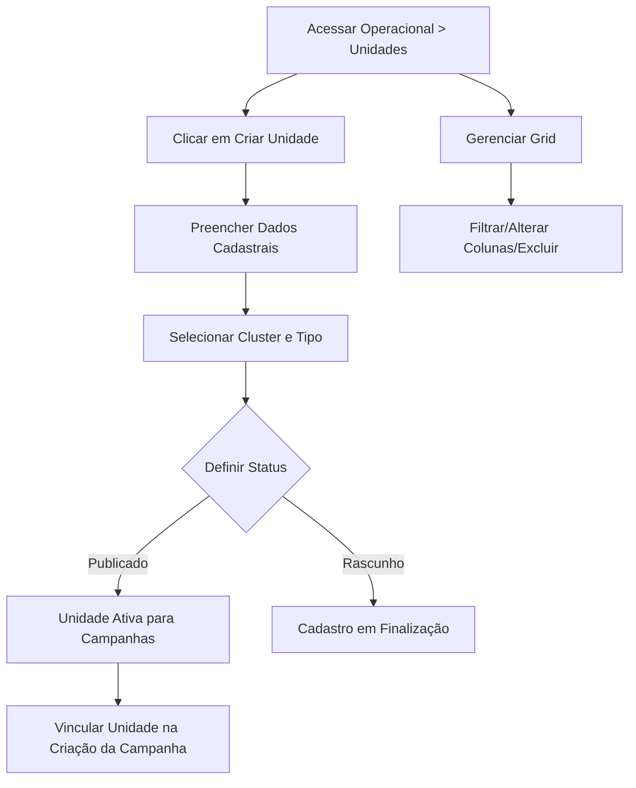

## Introdução

A Gestão de Lojas (Unidades) permite cadastrar e organizar todas as unidades da sua rede — sejam elas lojas físicas, centros de distribuição (CD) ou qualquer ponto de venda. É nesta seção que você centraliza as informações estratégicas de cada unidade para organizar suas campanhas e garantir que os materiais promocionais cheguem ao destino correto.

!!! info "Caminho"
    Menu Lateral esquerdo → Operacional → Unidades

## Entrega de Valor

- **Centralização de Dados:** Todas as informações de contato e localização em um só lugar.
- **Segmentação por Tipo:** Diferenciação clara entre Lojas e Centros de Distribuição.
- **Organização por Clusters:** Agrupamento facilitado para aplicação de campanhas regionais.
- **Precisão na Campanha:** Vinculação direta entre a unidade e as ações de marketing.

## Funcionalidades Principais

### 1: Criação de Unidades
Acesse **Operacional -> Unidades** e clique em **Criar Unidade**. Preencha os campos conforme detalhado abaixo:

|**Campo**|**Descrição**|
|---|---|
|**Nome da Loja**|Identificação nominal da unidade (Obrigatório).|
|**E-mail**|Correio eletrônico oficial da unidade para comunicações.|
|**CNPJ**|Cadastro Nacional da Pessoa Jurídica da unidade.|
|**Endereço**|Localização física completa da loja ou CD.|
|**Telefone**|Contato telefônico direto da unidade.|
|**Horário de atendimento**|Período de funcionamento da unidade para o público.|
|**Cluster**|Grupo ao qual a unidade pertence (Ex: Regional Sul).|
|**Número da unidade**|Código identificador interno da loja na rede.|
|**Tipo**|Define se a unidade é uma **Loja** ou um **CD** (Centro de Distribuição).|

**Status e Opções Adicionais:**

- **Status:** Pode ser definido como **Rascunho** ou **Publicado**.
- **É rede?:** Chave seletora para identificar se a unidade representa a rede matriz.

**Opções de Finalização:**

- **Criar:** Salva a unidade e permanece na tela de edição.
- **Salvar e criar outro:** Conclui o cadastro atual e limpa os campos para uma nova inserção.

!!! tip "Botão cancelar"
    O botão **Cancelar** interrompe o processo sem salvar as alterações e retorna para a listagem principal.

### 2: Integração com Campanhas
A principal vantagem do cadastro de unidades é a sua integração nativa com o módulo de marketing:

- **Vinculação:** Ao criar ou gerenciar uma campanha, é possível vincular especificamente quais unidades participarão daquela ação.
- **Personalização:** Garante que informações específicas da loja (como endereço ou telefone) possam ser utilizadas dinamicamente nos modelos de mídia.

### 3: Visualização e Gerenciamento na Grid
A tela principal permite gerenciar o parque de lojas com eficiência através de ferramentas de busca e filtragem:

- **Pesquisa:** Localize rapidamente uma unidade digitando o nome na barra de busca.
- **Alterar Colunas:** Personalize a grid marcando apenas as colunas que deseja visualizar para facilitar a conferência de dados.
- **Filtros de Status:** 

    - Não exibir registros excluídos (Padrão).
    - Exibir registros excluídos.
    - Somente registros excluídos.

!!! info "Exclusão em massa"
    Para limpar registros antigos ou desativados: Acesse Unidades > Marque o Checkbox **"Name"** (ou selecione unidades específicas) > Clique no botão **"Abrir ações"** > Selecione **Excluir selecionado**.

## Fluxo de Trabalho

---

## Perguntas Frequentes (FAQ)

!!! question "Qual a diferença entre o tipo Loja e CD?"
    **Loja** refere-se ao ponto de venda direto ao consumidor, enquanto **CD** (Centro de Distribuição) é focado em logística e armazenamento. Essa distinção ajuda a filtrar para quem enviar determinados materiais de apoio.

!!! question "Posso alterar o cluster de uma loja depois de criada?"
    Sim. Você pode editar a unidade a qualquer momento e trocar o cluster. Isso atualizará automaticamente a inclusão da loja em campanhas que utilizem o cluster como filtro.

!!! question "Como encontro uma loja que excluí por engano?"
    Basta utilizar o filtro na grid e selecionar a opção **"Somente registros excluídos"**. O sistema exibirá as unidades removidas para consulta.

## Considerações Finais
Manter o cadastro de unidades atualizado é vital para o sucesso das campanhas. Dados precisos de endereço e CNPJ garantem que a automação de peças publicitárias ocorra sem erros, refletindo a realidade de cada loja para o consumidor final.

## Leia Também